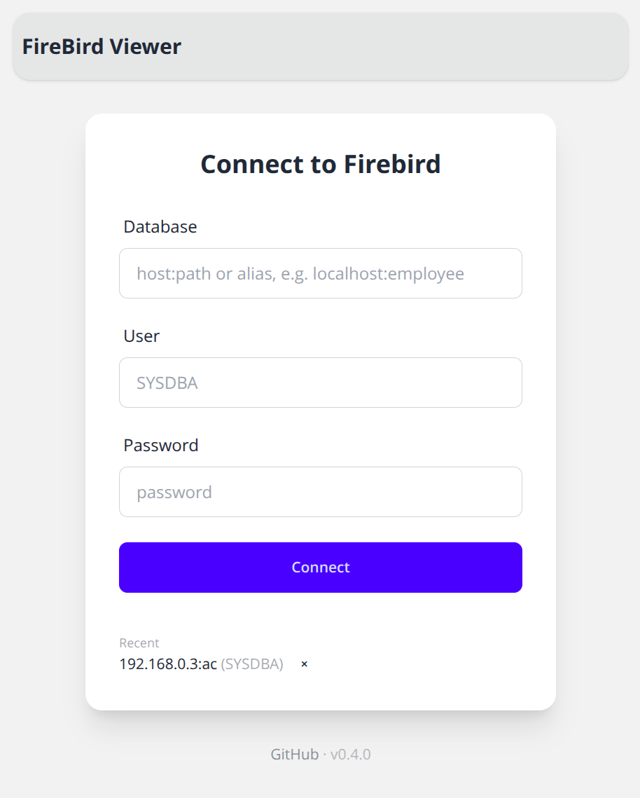
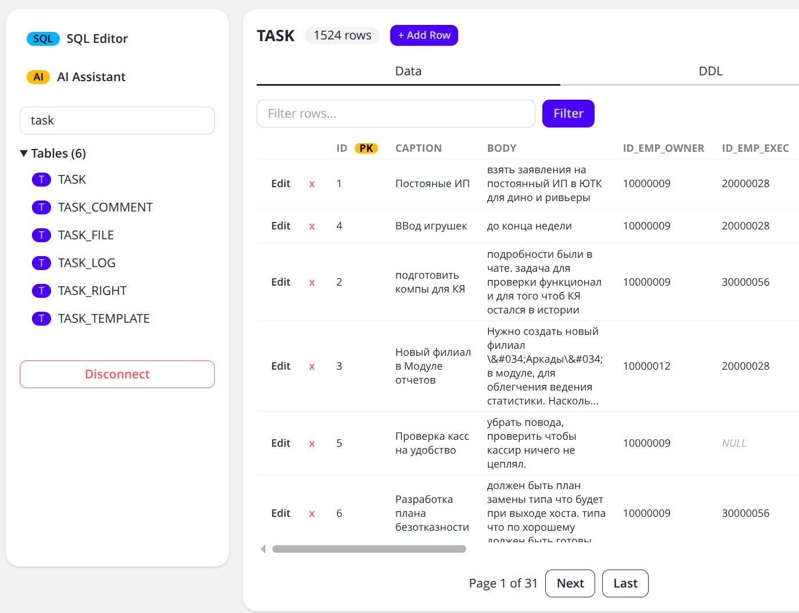
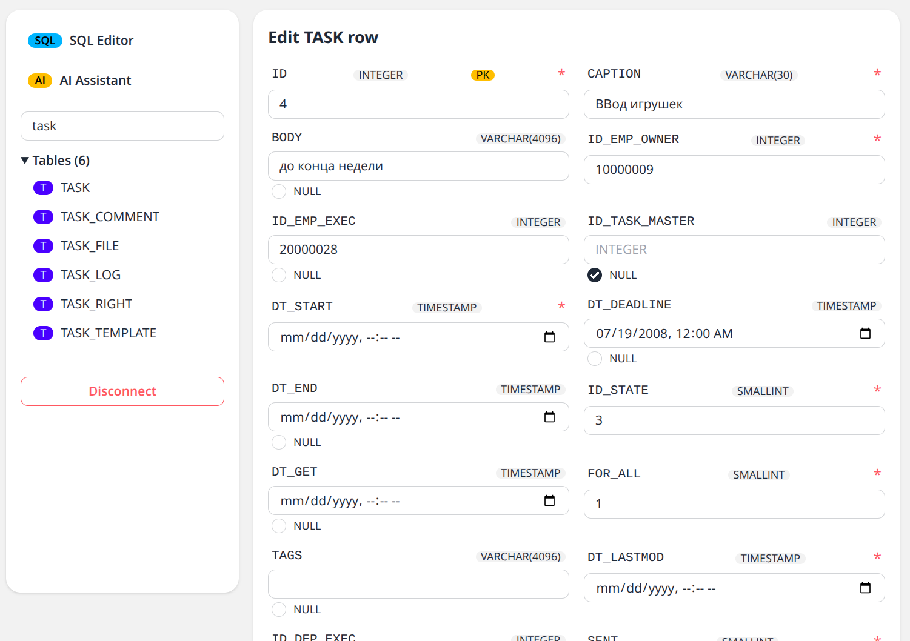
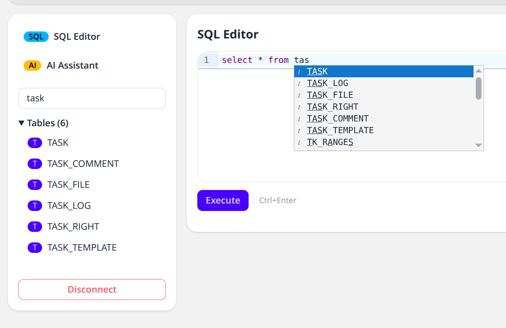
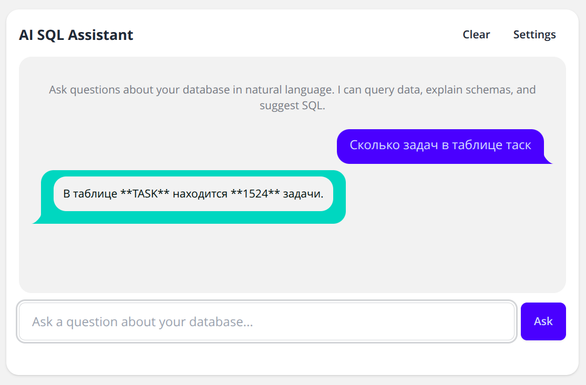

# FireBird Viewer

Web-based admin tool for Firebird SQL databases.
Built with Python (FastHTML + HTMX + DaisyUI) and async SQLAlchemy.
Runs fully offline — no internet required at runtime.

## Features

- **Quick Connect** — connect to any Firebird database (host:path, user, password)
- **Object Browser** — sidebar tree with Tables, Views, Procedures
- **Data Viewer** — paginated table data with column sorting
- **DDL Viewer** — generated CREATE TABLE statements
- **Procedure Viewer** — source code, parameters, execute with results
- **Inline Editing** — click any cell to edit, Enter to save
- **Insert / Delete Rows** — add new rows, delete with confirmation
- **SQL Editor** — CodeMirror 6 with syntax highlighting, schema autocomplete, Ctrl+Enter
- **AI SQL Assistant** — natural-language queries via any OpenAI-compatible API (PydanticAI)
- **Docker** — multi-stage build, fully offline, no CDN dependencies

> **AI Assistant safety:** The agent executes only read-only `SELECT` queries automatically.
> Any data-modifying statement (`INSERT`, `UPDATE`, `DELETE`, `DROP`, etc.) is **never**
> executed by the agent — it only suggests SQL and requires explicit user confirmation.

## Screenshots

| Connect | Browse table data |
| --- | --- |
| [](docs/screenshots/connect.png) | [](docs/screenshots/table-data.png) |

| Edit rows | SQL editor |
| --- | --- |
| [](docs/screenshots/edit-row.png) | [](docs/screenshots/sql-editor.png) |

### AI SQL Assistant

[](docs/screenshots/ai-assistant.png)

## Tech Stack

- **Backend:** Python 3.13, FastHTML, SQLAlchemy 2.0 async
- **DB Driver:** [sqlalchemy-firebird-async](https://pypi.org/project/sqlalchemy-firebird-async/) with firebird-driver
- **Frontend:** HTMX, DaisyUI/Tailwind CSS, CodeMirror 6 — all served locally
- **Session:** Encrypted cookies (Fernet via cryptography)
- **Build:** esbuild (JS bundle), Tailwind CLI (CSS), npm

## Getting Started

### Prerequisites

- Python 3.13+
- [uv](https://docs.astral.sh/uv/) package manager
- Node.js 20+ (for building frontend assets)
- Firebird database server

### Install and Run

```bash
uv sync                    # install Python dependencies
npm install                # install build tooling
npm run build              # build vendor assets (CSS/JS)
just run                   # start server on localhost:5001
```

Open `http://localhost:5001` in your browser.

### Docker

```bash
docker build -t firebird-viewer .
docker run -p 5001:5001 firebird-viewer
```

No internet required inside the container — all assets are baked in at build time.

### Demo environment

The repository includes a self-resetting Firebird 5 demo with prefilled public
credentials. See [Demo environment](docs/demo.md) for local and Portainer
deployment instructions.

To serve the app under a sub-path:

```bash
docker run -p 5001:5001 -e APP_ROOT_PATH=/viewer firebird-viewer
```

Then open `http://localhost:5001/viewer`.

### Commands

```bash
just run          # start dev server on localhost:5001
just check        # fmt + lint + arch-test + test (must pass before commit)
just test         # pytest
just fmt          # ruff format
just lint         # ruff check
just build-vendor # rebuild CSS/JS vendor assets
```

## Project Structure

```
main.py              # Composition root: routes, app config
src/
  domain/            # Pydantic models (no dependencies)
  application/       # Use cases and ports (abstract interfaces)
  repository/        # Firebird SQL queries (SQLAlchemy async), AI agent (PydanticAI)
  interface/         # FastHTML components and session management
static/
  vendor/            # Built assets: styles.css, htmx.min.js, codemirror.bundle.js
  app.js             # Client JS (toasts, confirm modal, inline editing)
  codemirror-init.js # CodeMirror initialization and HTMX sync
  src/               # Build sources (Tailwind input, CodeMirror entry)
tests/               # pytest unit tests
Dockerfile           # Multi-stage: node (build) → python (runtime)
```
